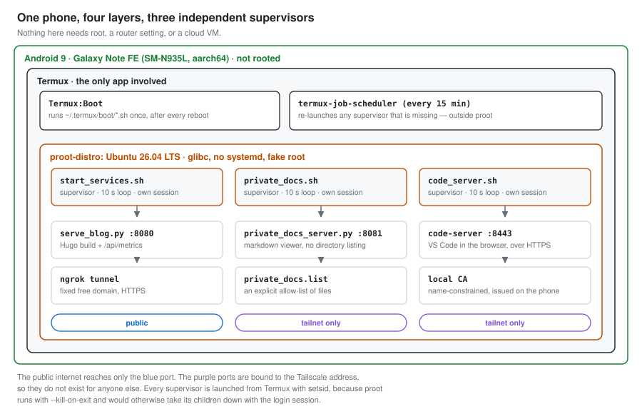
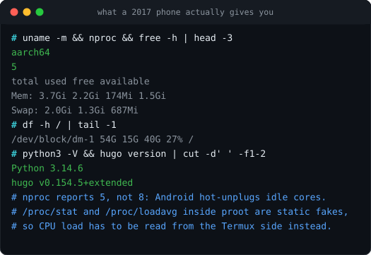
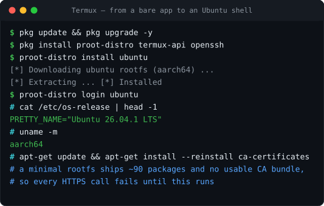
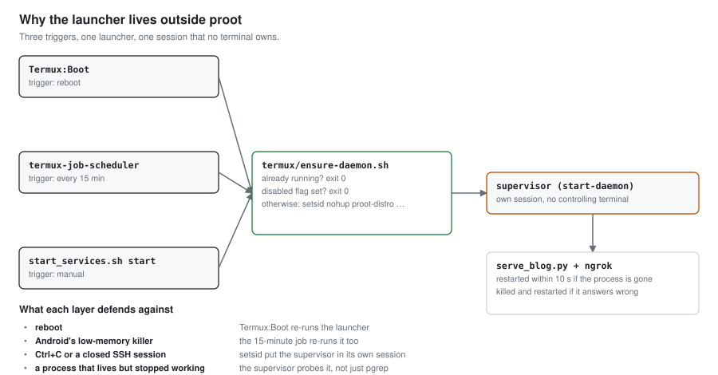
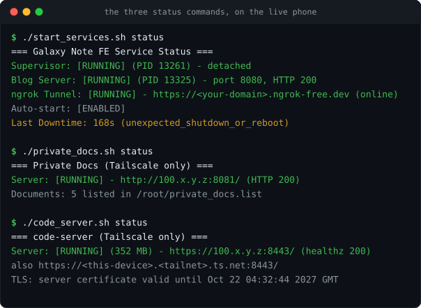
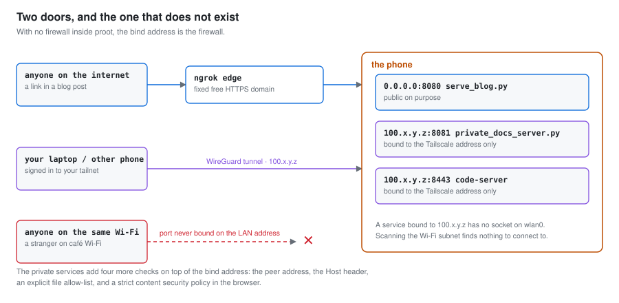

<h1 align="center">phone-homeserver</h1>

<p align="center">
  A 2017 Android phone, no root and no cloud host — running a public blog,<br>
  a private document viewer and a browser IDE, 24 hours a day.
</p>

<p align="center">
  <a href="LICENSE"></a>
  
  
  
  
</p>

<p align="center">
  <b>English</b> · <a href="README.ko.md">한국어</a>
</p>

---

This is the working setup of one phone, not a tutorial written from memory. Every
command here ran on a Samsung Galaxy Note FE (`SM-N935L`) that has been serving
[qofo.github.io](https://qofo.github.io/) since 2026-09-17, and every number in the
documentation comes from its own logs.



## Why an old phone

A phone you already own is a better first server than a single-board computer, on
four counts: it costs nothing, it draws under 5 W, it has a battery that doubles as
an uninterruptible power supply, and it has a screen for when networking breaks.
A Galaxy Note FE beats a Raspberry Pi 3 on CPU and RAM.

What you give up is a normal Linux. There is no root, no `systemd`, no Docker, no
firewall, and `/proc` lies to you. Those constraints shape every script in this
repository, and [`docs/04-always-on.md`](docs/04-always-on.md) explains each one.



## What you get

| Service | Address | Reachable from | Built with |
|:---|:---|:---|:---|
| **Blog** — Hugo site + live hardware dashboard | `:8080` behind an ngrok domain | the public internet | `serve_blog.py`, Python stdlib |
| **Private docs** — markdown viewer over an allow-list | `:8081` | your tailnet only | `private_docs_server.py`, Python stdlib |
| **code-server** — VS Code in the browser, HTTPS | `:8443` | your tailnet only | code-server + a local CA |

Each service has its own supervisor that restarts it within ten seconds, survives a
reboot, and keeps running after you close the terminal.

## Requirements

**Hardware**

- An Android phone, **arm64 (`aarch64`)**, Android 7 or newer. Root is not needed.
- **2 GB RAM** is enough for the blog alone; **3 GB+** if you also want code-server.
- **8 GB** free storage for the Ubuntu rootfs, Hugo and code-server.
- A charger you can leave plugged in, and ideally a case you can leave open — a
  fanless phone under load gets warm.

**Apps** — all free, none from the Play Store except Tailscale.

| App | Where to get it | What it is for |
|:---|:---|:---|
| **Termux** | [F-Droid](https://f-droid.org/en/packages/com.termux/) — **not** the Play Store build, which is abandoned | the Linux shell everything runs in |
| **Termux:Boot** | [F-Droid](https://f-droid.org/en/packages/com.termux.boot/) | starts the server after a reboot |
| **Termux:API** | [F-Droid](https://f-droid.org/en/packages/com.termux.api/) | battery, temperature and notifications |
| **Tailscale** | [Play Store](https://play.google.com/store/apps/details?id=com.tailscale.ipn) | the private network for `:8081` and `:8443` |
| **ngrok account** | [ngrok.com](https://ngrok.com) (free) | one permanent public HTTPS address |

Install all three Termux apps from F-Droid in one go. Mixing F-Droid and Play Store
builds of Termux breaks the add-ons, because Android refuses to let apps with
different signing keys talk to each other.

## Quick start

Six steps. The detail behind each one is in [Documentation](#documentation).

### 1. Get a Linux shell

```bash
pkg update && pkg upgrade -y
pkg install proot-distro termux-api openssh
proot-distro install ubuntu
proot-distro login ubuntu
```

Inside Ubuntu, fix the certificate bundle before anything else. A minimal rootfs
ships without a usable one, and every HTTPS call fails until you do.

```bash
apt-get update && apt-get install --reinstall ca-certificates
apt-get install -y python3 git curl hugo
```



### 2. Put the files on the phone

```bash
cd /root
git clone https://github.com/qofo/phone-homeserver.git
cp phone-homeserver/*.py phone-homeserver/*.sh /root/
cp -r phone-homeserver/tests phone-homeserver/private_docs_static /root/
mkdir -p /root/termux && cp phone-homeserver/termux/*.sh /root/termux/
chmod +x /root/*.sh /root/termux/*.sh /root/*.py
```

Every script assumes it lives in `/root`. See [Configuration](#configuration) to
move them.

### 3. Serve something

```bash
./start_services.sh start
curl -sI http://127.0.0.1:8080/ | head -1
```

### 4. Get a permanent public address

Put your token in `~/.config/ngrok/ngrok.yml`, then set `NGROK_DOMAIN` at the top of
`start_services.sh` to the free static domain ngrok gave you.

```yaml
version: "3"
agent:
  authtoken: <your token>
```

Of the three ways to get a fixed address without buying a domain, only one worked on
a phone that moves between networks. [`docs/03-public-address.md`](docs/03-public-address.md)
compares all three.

### 5. Make it survive a reboot

From the **Termux** shell, not from inside Ubuntu:

```bash
ROOTFS=$PREFIX/var/lib/proot-distro/containers/ubuntu/rootfs
mkdir -p ~/.termux/boot
ln -s $ROOTFS/root/termux/ensure-daemon.sh ~/.termux/boot/start-server.sh
termux-job-scheduler --job-id 4241 --period-ms 900000 --persisted true \
    --script $ROOTFS/root/termux/ensure-daemon.sh
```

This is the one step that has no equivalent on a normal server, and the one that
took two rewrites to get right. `proot` runs with `--kill-on-exit`, so anything
started from inside a login session dies with that session. The launcher has to live
on the Termux side and use `setsid`.



### 6. Check it from somewhere else

```bash
./start_services.sh status
python3 tests/test_serve_blog.py
```



## Repository layout

```
.
├── serve_blog.py              public blog + /api/metrics          :8080
├── start_services.sh          supervisor for the blog and ngrok
├── publish_blog.sh            build and deploy to the phone and GitHub Pages
├── measure_downtime.py        measures the outage a restart causes
├── private_docs_server.py     tailnet-only markdown viewer         :8081
├── private_docs.sh            supervisor for the docs viewer
├── private_docs.list.example  the allow-list of files it may serve
├── code_server.sh             supervisor for code-server, plus its CA and TLS  :8443
├── private_docs_static/       marked + DOMPurify + the viewer's CSS and JS
├── termux/                    launchers that must run outside proot
│   ├── ensure-daemon.sh         blog and ngrok
│   ├── ensure-private-docs.sh   docs viewer
│   ├── ensure-code-server.sh    code-server
│   ├── battery-watch.sh         charge alerts and a battery log
│   └── claude-session.sh        a tmux session that outlives the SSH connection
├── tests/
│   ├── test_serve_blog.py       35 black-box tests
│   └── test_private_docs.py     47 black-box security tests
└── docs/                      the guide, in English and Korean
```

The three supervisors take the same five commands:

```bash
./start_services.sh   {start|stop|restart|status|start-daemon}
./private_docs.sh     {start|stop|restart|status|start-daemon}
./code_server.sh      {start|stop|restart|status|start-daemon}
```

## Documentation

The README covers the path that gets a server running. Everything else lives here,
and every page exists in both languages.

| | Document | What it covers |
|:--|:---|:---|
| 1 | [Installation](docs/01-install.md) · [한국어](docs/01-install.ko.md) | Termux, `proot-distro`, the CA bundle, SSH, and the binary-compatibility wall that forces all of it |
| 2 | [Web server](docs/02-web-server.md) · [한국어](docs/02-web-server.ko.md) | a static server on the standard library, Hugo on the phone, and publishing to the phone and GitHub Pages at once |
| 3 | [A public address](docs/03-public-address.md) · [한국어](docs/03-public-address.ko.md) | Cloudflare Tunnel vs DuckDNS + port forwarding vs an ngrok free domain, and why CGNAT decides for you |
| 4 | [Staying up](docs/04-always-on.md) · [한국어](docs/04-always-on.ko.md) | `--kill-on-exit`, `setsid`, Termux:Boot, the 15-minute watchdog, and health checks that catch a hung process |
| 5 | [Private access](docs/05-private-access.md) · [한국어](docs/05-private-access.ko.md) | Tailscale, binding as a firewall, the docs viewer's five defence layers, and code-server over HTTPS |
| 6 | [Operations](docs/06-operations.md) · [한국어](docs/06-operations.ko.md) | battery and heat, the metrics API, measuring downtime, load testing, and running the test suites |
| 7 | [Troubleshooting](docs/07-troubleshooting.md) · [한국어](docs/07-troubleshooting.ko.md) | every failure this phone actually produced, indexed by the symptom you will see |

Four longer working documents sit in [`docs/reference/`](docs/reference). They are the
server's own operating notes — the full environment specification, the code-server
guide, the Hugo migration plan and a load-test specification. **They are Korean only**,
because they are internal records rather than part of the guide.

## Configuration

Paths are hard-coded to `/root`. To run this somewhere else, change:

| Setting | Where |
|:---|:---|
| your ngrok domain | `NGROK_DOMAIN` in `start_services.sh`, `DEFAULT_PUBLIC_URL` in `measure_downtime.py` |
| the blog source and build directory | `SRC` in `publish_blog.sh`, `BLOG_SITE_DIR` in `serve_blog.py` (also an environment variable) |
| which documents the viewer may serve | `cp private_docs.list.example private_docs.list`, then one path per line |
| the docs viewer's bind address and port | `PRIVATE_DOCS_BIND`, `PRIVATE_DOCS_PORT`, `PRIVATE_DOCS_ALLOW`, `PRIVATE_DOCS_LIST`, `PRIVATE_DOCS_STATE` |
| your MagicDNS name, for the TLS certificate | `MAGIC_DNS` in `code_server.sh` (empty in this copy on purpose) |
| the job IDs, if 4241–4246 are taken | `LAUNCH_JOB_ID` in each supervisor |

Your ngrok token belongs in `~/.config/ngrok/ngrok.yml`, never in the repository.

## Security notes

- **Never bind a private service to `0.0.0.0`.** There is no firewall inside `proot`
  and no root to add one, so the bind address *is* the firewall. `:8081` and `:8443`
  are bound to the Tailscale address only.
- The two private services do not share a supervisor with the public one. A bad
  restart of the blog cannot take them with it, and vice versa.
- No token, key or real public IP is committed here. Addresses in `docs/` are
  examples: `192.168.0.42`, `100.x.y.z`, `203.0.113.10`.
- `tests/test_private_docs.py` is a black-box security suite — path traversal,
  symlink escape, `Host` header, rebinding, allow-list bypass. Run it after any
  change to the viewer.



## The blog series

Each design decision here was written up as it happened. The posts carry the failures
and the logs that the documentation only summarises. They are in Korean, at
[qofo.github.io](https://qofo.github.io/) — source in
[`qofo/qofo.github.io`](https://github.com/qofo/qofo.github.io).

## Read this in other languages

Korean: **[한국어 문서](README.ko.md)**. Translations are welcome — open a pull
request adding `README.<lang>.md` and the matching `docs/*.<lang>.md` pages, and it
will be linked here.

## License

[MIT](LICENSE) for the code and documentation. Third-party files in
`private_docs_static/` keep their own licences.

| File | License |
|:---|:---|
| `marked.umd.min.js` (marked 18.0.13) | MIT |
| `purify.min.js` (DOMPurify 3.4.15) | Apache-2.0 or MPL-2.0 |
