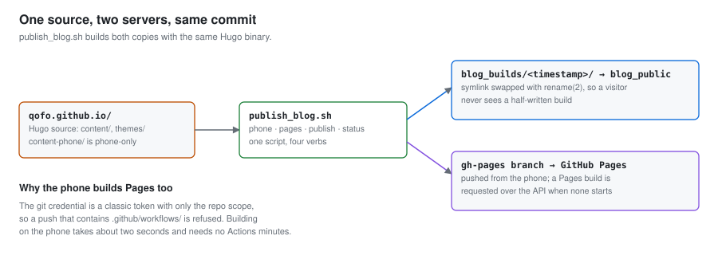

# 2. Web server — the standard library, then Hugo

<b>English</b> · [한국어](02-web-server.ko.md)

[← 1. Installation](01-install.md) · Next: [3. A public address](03-public-address.md)

---

A phone can serve a website with no web server installed at all. This page goes from
that one-liner to the arrangement this repository actually runs: Hugo builds a static
site, `serve_blog.py` serves it, and the same commit is published to the phone and to
GitHub Pages at once.

## 2.1 The thirty-second version

```bash
cd /root/site && python3 -m http.server 8080 --bind 127.0.0.1
curl -sI http://127.0.0.1:8080/ | head -1
```

That is enough to confirm the phone can serve HTTP. It is not enough to leave
running: `http.server` lists directories, follows symlinks out of the tree, sets no
cache headers, and serves whatever is on disk at that instant — including a
half-written build.

## 2.2 Render at build time, not at request time

The first version of this blog was a single Python file that parsed markdown
filenames on each request and let the browser render the markdown. It worked, and it
had one fatal property: **if the phone was off, there was no site.** During the
reboot incident in [`04-always-on.md`](04-always-on.md), visitors did not see a slow
page. They saw a tunnel error.

Moving to a static site generator fixes that, because the built output is just files.
Those files can be copied somewhere with better uptime than a phone, and served from
both places.

```bash
apt-get install -y hugo         # 0.154.5+extended here
hugo new site blog && cd blog
hugo --gc --minify -d public
```

Hugo builds the ten-post site on this phone in about two seconds. Choose a theme the
phone can actually build: check `min_version` first, and prefer a theme copied into
`themes/` over a git submodule or a Hugo module, so a build needs no network.



## 2.3 Serving a build safely

`serve_blog.py` is a `ThreadingHTTPServer` on the standard library. What it adds over
`http.server` is all defensive:

| Behaviour | Why |
|:---|:---|
| every path resolved and checked to be inside the build root | `..` sequences and symlinks both escape a naive join |
| no directory listing, ever | a listing turns one leaked path into a map of the whole tree |
| `index.html` served for a directory, with a redirect for the missing slash | matches what Hugo generates |
| long `Cache-Control` for hashed assets, short for HTML | a phone uplink is the bottleneck, so caching matters more than usual |
| `/api/metrics` for live battery, memory, temperature and uptime | the dashboard's only data source |
| explicit `OPTIONS` handling, not just `Access-Control-Allow-Origin` | see below |

The CORS detail is worth spelling out, because a `curl` check will not find it. A
browser sending a non-standard request header — `ngrok-skip-browser-warning`, in this
case — issues a `preflight` `OPTIONS` request first. Python's
`BaseHTTPRequestHandler` answers an unimplemented method with **501**, the preflight
fails, and the dashboard shows no data while `curl` against the same URL returns 200.
Handle `OPTIONS` explicitly.

```bash
BLOG_SITE_DIR=/root/blog_public python3 serve_blog.py
```

## 2.4 Swap builds atomically

Build into a new directory and move a symlink; never build over what you are serving.

```bash
out=/root/blog_builds/$(date +%Y%m%d-%H%M%S)
hugo --gc --minify -d "$out"
ln -sfn "$out" /root/blog_public.new
mv -Tf /root/blog_public.new /root/blog_public     # rename(2): atomic
```

`mv -T` on a symlink is a single `rename(2)`, so a request either gets the old build
or the new one. Without it, there is a window where the site is half-written and
visitors get 404s for assets that exist in both builds.

When no build is present at all, `serve_blog.py` answers 200 with a short placeholder
rather than 500. A monitoring probe should see "up, empty", not "broken".

## 2.5 One source, two servers

`publish_blog.sh` takes four verbs:

```bash
./publish_blog.sh phone      # build and swap the phone copy
./publish_blog.sh pages      # build and push the gh-pages branch
./publish_blog.sh publish    # both, from the same commit
./publish_blog.sh status     # which commit each copy is serving
```

The phone builds the GitHub Pages copy too, which is unusual. The reason is the
credential: a classic token with only the `repo` scope cannot push a path under
`.github/workflows/`, so a GitHub Actions workflow is not an option here. Building on
the phone takes two seconds, needs no Actions minutes, and guarantees both copies
come from the same commit and the same Hugo binary.

Two things to know if you copy this arrangement:

- **A push to `gh-pages` does not reliably start a Pages build.** Observed once, then
  not at all for eight minutes. `publish_blog.sh` watches for a build and requests
  one over the API (`POST /repos/<owner>/<repo>/pages/builds`) when none appears.
- **Pages serves the branch, so an edit made on github.com is not on the phone.**
  Run `publish` on the phone to bring them back together, and use `status` to see
  whether they have drifted.

## 2.6 Keep phone-only pages out of the public build

The live dashboard calls `/api/metrics` on the phone. On a public site, that means
every visitor's browser reaches into your phone, which is the wrong shape. Hugo's
configuration directories solve it: the dashboard content lives in `content-phone/`
and is mounted only by the phone's configuration.

```toml
# config/phone/hugo.toml — merged over the shared config for the phone build only
[[module.mounts]]
  source = "content-phone"
  target = "content"
```

One trap: **menus do not merge across Hugo configuration directories.** A
`config/phone/hugo.toml` that defines one extra menu entry replaces the whole menu,
so it has to repeat the shared entries too.

## 2.7 Verify

```bash
python3 tests/test_serve_blog.py     # 35 black-box tests
./publish_blog.sh status
curl -sI http://127.0.0.1:8080/ | head -1
curl -s http://127.0.0.1:8080/api/metrics | head -c 200
```

The test suite covers path traversal, symlink escape, redirects, cache headers, CORS
preflight and the build swap. It uses temporary directories and its own port, so it
is safe to run against a live phone. A useful sanity check on the suite itself: copy
the server, delete the path check from the copy, and confirm the tests fail.

Next: make it reachable from outside the house → [3. A public address](03-public-address.md)
