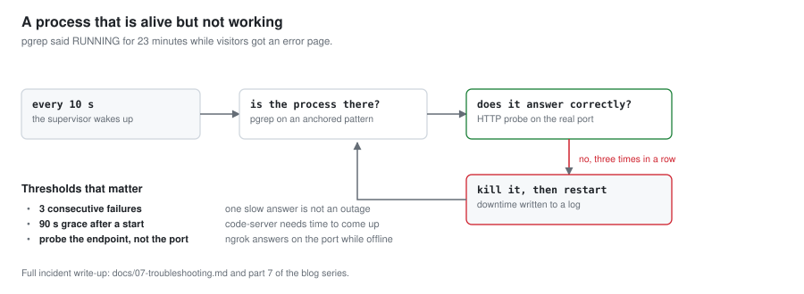

# 4. 계속 떠 있게 — 일반 서버에는 대응물이 없는 단계

[English](04-always-on.md) · <b>한국어</b>

[← 3. 공개 주소](03-public-address.ko.md) · 다음: [5. 비공개 접근](05-private-access.ko.md)

---

일반 서버라면 유닛 파일 하나를 쓰고 잊으면 된다. 여기에는 `systemd`가 없고, 진짜 root가
없고, 백그라운드 프로세스를 일부러 죽이는 운영체제가 있다. 이 문서는 살아남은 설계와,
살아남지 못한 설계 둘의 기록이다.

## 4.1 제약과, 각 제약이 물어뜯는 지점

`proot-distro`는 컨테이너가 아니다. `ptrace`로 시스템 콜을 가로채 경로를 바꿔치기하는,
전부 사용자 공간의 동작이다. 루팅하지 않은 폰에서 진짜 glibc를 얻는 대가는 아래와 같다.

| 제약 | 실제로 무슨 뜻인가 |
|:---|:---|
| **`root`는 root가 아니다** | `whoami`는 `root`라고 하지만 여전히 앱의 UID다. 1024번 아래 포트 바인딩 불가, `iptables` 불가, 커널 모듈 불가, 로우 소켓 불가. |
| **`systemd`가 없다** | `systemctl`은 고장 난 것이 아니라 아예 없다. 오래 도는 프로세스는 모두 내가 쓴 감독자가 필요하다. |
| **`--kill-on-exit`** | `proot-distro`는 로그인 세션이 끝나면 추적 대상 트리를 전부 죽인다. 우분투 안의 셸에서 띄운 것은 그 셸과 함께 죽는다. |
| **`/proc`은 부분적으로 거짓** | `proot` 안의 `/proc/stat`, `/proc/uptime`, `/proc/loadavg`는 정적이거나 가짜 값이다. CPU 부하는 Termux 쪽에서 읽어야 한다. |
| **`PATH`가 섞인다** | Termux 바이너리와 우분투 바이너리가 모두 잡힌다. 감독자가 실행하는 것은 절대 경로로 쓴다. |
| **안드로이드가 죽인다** | 저메모리 킬러가 경고 없이 `SIGKILL`로 백그라운드 프로세스를 정리한다. 화면이 꺼지고 기기가 정지 상태면 Doze가 CPU와 네트워크를 묶는다. |

마지막 둘이, 감독자만으로는 부족한 이유다. 감독자 자신이 죽는다.

## 4.2 1차 설계와, 하루를 못 버틴 이유

첫 설계는 세 층이었다. Termux:Boot 스크립트, 10초 주기 감시 루프, 그리고 "안 떠 있으면
띄운다"를 셸 프로필 세 곳에 넣는 것 — Termux `~/.bashrc`, 우분투 `/root/.bashrc`, 부팅
스크립트다. 어느 문으로 들어와도 서버가 살아난다는 발상이었다.

`pkill -9` 시험은 통과했다. 다음 날 아침은 이랬다.

```
Blog Server:  [STOPPED]
ngrok Tunnel: [STOPPED]
```

결함이 셋이었고, 셋 모두 실행한 시험에는 보이지 않는 것이었다.

**서비스가 로그인 세션 안에서 태어났다.** `.bashrc` 진입점이 띄운 프로세스는 `proot` 안
셸의 자식이었다. 그 셸이 끝나자 `--kill-on-exit`가 데려갔다. 시험은 *서비스*를 죽이고
복구를 봤을 뿐, *세션*을 닫아 본 적이 없었다.

**감독자가 터미널의 프로세스 그룹을 공유했다.** SSH 셸에서 띄운 탓에 터미널 신호를 함께
받았다. 다른 것을 향해 누른 `Ctrl+C`가 그룹 전체에 전달됐다. 로그의 `[CRASH DETECTED]`
줄은 복구의 증거가 아니라 증상이었다. 운영자 자신의 키 입력이 계속 죽이고 있는 프로세스를
감독자가 계속 되살리고 있었다.

**`pgrep -f`가 너무 많이 맞혔다.** 고정되지 않은 패턴은 감독자 자신의 명령줄, 그 파일을
열어 둔 편집기, 심지어 `grep`까지 맞힌다. 감독자는 죽은 서비스를 살아 있다고 믿었다.

> **복구 장치를 만든 것과 복구되는 것을 확인한 것은 다르다.** `pkill` 시험은 "프로세스가
> 죽는 경우"만 덮는다. "감독자가 죽는 경우", "프로세스가 잘못된 세션에서 태어난 경우",
> "프로세스가 살아 있지만 일하지 않는 경우"는 덮지 않는다.

## 4.3 2차 설계: 런처 하나, proot 밖에


이제 모든 진입점은 **Termux** 쪽의 같은 스크립트를 부르고, 감독자를 띄우는 것은 그
스크립트뿐이다.

```sh
#!/data/data/com.termux/files/usr/bin/sh
# termux/ensure-daemon.sh — 축약
PREFIX=/data/data/com.termux/files/usr
ROOTFS=$PREFIX/var/lib/proot-distro/containers/ubuntu/rootfs
PID_FILE=$ROOTFS/root/.start_services.pid

[ -e "$ROOTFS/root/.services_disabled" ] && exit 0

if [ -r "$PID_FILE" ]; then
    pid=$(cat "$PID_FILE" 2>/dev/null)
    case "$(tr '\0' ' ' < "/proc/$pid/cmdline" 2>/dev/null)" in
        *"start_services.sh start-daemon"*) exit 0 ;;
    esac
fi

setsid nohup "$PREFIX/bin/proot-distro" login ubuntu -- \
    /root/start_services.sh start-daemon </dev/null >>"$LOG" 2>&1 &
```

일하고 있는 판단은 네 가지다.

- **`setsid`**가 감독자에게 제어 터미널 없는 자체 세션을 준다. 어느 셸에서 누른
  `Ctrl+C`도, 어느 로그아웃도 감독자와 그 자식에게 닿지 않는다. 결함 둘의 해결이다.
- **PID 파일을 `pgrep`이 아니라 `/proc/<pid>/cmdline`과 대조한다.** 재사용된 PID가 다른
  프로세스의 것이면 "이미 실행 중"으로 세지 않는다. 결함 셋의 해결이다.
- **비활성 플래그를 무엇보다 먼저 확인한다.** 점검은 `/root/.services_disabled`를 만드는
  것이고, 계속 되살아나는 것과 싸우는 일이 아니다.
- **스크립트는 멱등이다.** 서로 다른 트리거 셋이 부르고, 그중 둘은 같은 초에 불릴 수 있다.

트리거는 이렇게 건다.

```bash
# Termux에서
ROOTFS=$PREFIX/var/lib/proot-distro/containers/ubuntu/rootfs
mkdir -p ~/.termux/boot
ln -s $ROOTFS/root/termux/ensure-daemon.sh ~/.termux/boot/start-server.sh

termux-job-scheduler --job-id 4241 --period-ms 900000 --persisted true \
    --script $ROOTFS/root/termux/ensure-daemon.sh
```

`Termux:Boot`이 재부팅을 덮는다. `termux-job-scheduler`가 저메모리 킬러에 대한 답이다.
Termux가 메모리에 있든 없든 안드로이드가 15분마다 런처를 다시 실행한다.
`--persisted true`는 재부팅 뒤에도 작업을 유지한다. 15분은 주기 작업에 대한 플랫폼의
하한이다. 더 짧게 요구하면 조용히 15분이 된다.

서비스마다 런처와 작업 번호를 따로 둬서, 하나가 재시작해도 다른 것을 건드리지 않는다.

| 서비스 | 런처 | 작업 번호 |
|:---|:---|:---|
| 블로그 + ngrok | `termux/ensure-daemon.sh` | 4241, 4242 |
| 비공개 문서 | `termux/ensure-private-docs.sh` | 4243, 4244 |
| code-server | `termux/ensure-code-server.sh` | 4245, 4246 |

## 4.4 살아 있지만 일하지 않는 프로세스



2차 설계를 올린 다음 날 밤 폰이 재부팅됐고, 블로그 주소는 **23분** 동안 ngrok의
`ERR_NGROK_3200`(엔드포인트 오프라인)을 응답했다. 그 시간 내내 감독자는 `RUNNING`이라고
보고했고, 그것은 옳았다. `ngrok` 프로세스는 존재했다. 다만 서비스하기를 멈췄을 뿐이고,
`pgrep`은 그 차이를 구별할 수 없다.

첫 가설은 부팅 직후 네트워크가 준비되지 않아 에이전트가 엣지에 닿기 전에 시작했다는
것이었다. 두 번째 재부팅이 가설을 깼다. 에이전트는 잘 붙었고 나중에 멈췄다. 원인이
무엇이든 답은 같다. **프로세스가 있느냐를 묻지 말고, 대답하느냐를 물어야 한다.**

```sh
# start_services.sh — 축약
probe_blog()  { curl -fsS --max-time 5 -o /dev/null http://127.0.0.1:8080/; }
probe_ngrok() { curl -fsS --max-time 8 -o /dev/null \
                  -H 'ngrok-skip-browser-warning: 1' "$NGROK_DOMAIN/"; }

while :; do
    if ! pgrep -f "$BLOG_PATTERN" >/dev/null; then restart_blog; fi
    if ! probe_ngrok; then
        fails=$((fails + 1))
        [ "$fails" -ge 3 ] && { kill_ngrok; start_ngrok; fails=0; }
    else
        fails=0
    fi
    sleep 10
done
```

중요한 임계값이 셋이고, 셋 다 틀려 보고 배운 것이다.

- **1회가 아니라 연속 3회 실패.** 폰 업링크에서 한 번 느린 응답은 정상이다. 그것으로
  재시작하면 하루 종일 재시작하는 서비스가 된다.
- **시작 뒤 유예 시간.** code-server는 `/healthz`에 답하기까지 90초 정도가 걸린다. 시작
  중에 찌르면 영원히 죽인다.
- **방문자가 쓰는 엔드포인트를 찌른다.** `:8080`을 로컬에서 찌르는 방식은 그 23분 동안
  전부 통과했을 것이다. 고장 난 것은 서버가 아니라 터널이었기 때문이다.

프로세스 패턴도 앵커를 붙인다.

```sh
BLOG_PATTERN='^python3 (-u )?/root/serve_blog\.py'
NGROK_PATTERN='^/usr/local/bin/ngrok http '
```

## 4.5 다운타임을 기록으로 남긴다

감독자마다 하트비트 파일을 유지한다. 시작할 때 하트비트의 시각과 현재 시각을 비교해서,
간격이 있으면 폰이 꺼져 있었거나 멈춰 있었다는 뜻이므로 그 간격을 이유와 함께
`downtime.log`에 붙인다.

```
Last Downtime: 168s (unexpected_shutdown_or_reboot, 2026-09-19 17:27:59 ~ 17:30:47 UTC)
```

자기 운영체제에 의해 죽을 수 있는 기기에서 정직한 가동률 숫자를 얻는 유일한 방법이다.
계획된 재시작은 `measure_downtime.py`로 따로 잰다.
[`06-operations.ko.md`](06-operations.ko.md)에 있다.

## 4.6 제대로 검증하기

다섯 개를 모두 돌린다. 앞의 둘은 쉬운 것이고, 뒤의 셋이 실제 버그를 찾아낸 것이다.

```bash
# 1. 서비스가 죽는 경우
pkill -9 -f 'serve_blog\.py'          # 10초 안에 복귀

# 2. 감독자가 죽는 경우
pkill -9 -f 'start_services.sh start-daemon'
# 15분 주기 작업이 돌기 전까지는 아무것도 복구되지 않는다 — 의도된 동작이다

# 3. 세션이 닫히는 경우
./start_services.sh start && exit     # 로그아웃한 뒤 노트북에서 확인한다
ssh ... -p 8022 'proot-distro login ubuntu -- /root/start_services.sh status'

# 4. 죽는 대신 멈추는 경우
pkill -STOP -f 'ngrok http'           # 살아 있으나 무응답: 프로브가 잡아야 한다

# 5. 폰이 재부팅되는 경우
# 전원 버튼을 길게 누른다. Termux:Boot의 동작은 이것 말고는 증명되지 않는다.
```

4번에는 알아 둘 만한 함정이 있다. `SIGSTOP`으로 멈춘 프로세스는 `SIGTERM`을 보내고
기다리기만 하는 감독자로는 되살릴 수 없다. 멈춘 프로세스는 신호를 처리하지 않기 때문이다.
제한 시간이 지나면 `SIGKILL`을 보내야 한다.

다음: 나만 닿을 수 있는 서비스 → [5. 비공개 접근](05-private-access.ko.md)
