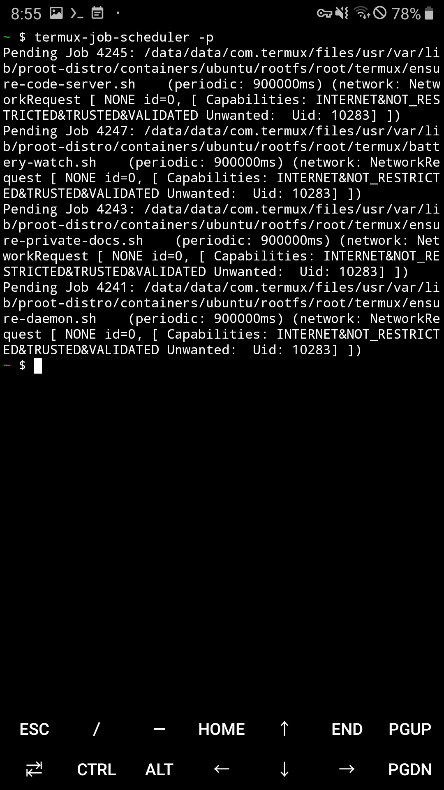

# 4. Staying up — the part that has no equivalent on a real server

<b>English</b> · [한국어](04-always-on.ko.md)

[← 3. A public address](03-public-address.md) · Next: [5. Private access](05-private-access.md)

---

On a normal server you write a unit file and stop thinking about it. Here there is no
`systemd`, no real root, and an operating system that kills background processes on
purpose. This page is the design that survived, and the two that did not.

## 4.1 The constraints, and where each one bites

`proot-distro` is not a container. It intercepts system calls with `ptrace` and
rewrites paths, entirely in user space. That buys a real glibc on an unrooted phone,
and costs the following.

| Constraint | What it means in practice |
|:---|:---|
| **`root` is not root** | `whoami` says `root`, but you are still the app's UID. No binding below port 1024, no `iptables`, no kernel modules, no raw sockets. |
| **no `systemd`** | `systemctl` is absent, not broken. Every long-running process needs a supervisor you wrote. |
| **`--kill-on-exit`** | `proot-distro` kills the whole tracee tree when the login session ends. Anything started from a shell inside Ubuntu dies with that shell. |
| **`/proc` partly lies** | `/proc/stat`, `/proc/uptime` and `/proc/loadavg` return static or fake values inside `proot`. CPU load has to be read from the Termux side. |
| **mixed `PATH`** | Termux binaries and Ubuntu binaries are both reachable. Use absolute paths in anything a supervisor runs. |
| **Android kills things** | The low-memory killer takes background processes with `SIGKILL` and no warning. Doze freezes CPU and network when the screen is off and the device is still. |

The last two are why a supervisor is not enough on its own: the supervisor itself gets
killed.

## 4.2 Version 1, and why it lasted less than a day

The first design had three layers: a Termux:Boot script, a ten-second watchdog loop,
and an "start it if it is not running" line in three different shell profiles — Termux
`~/.bashrc`, Ubuntu `/root/.bashrc`, and the boot script. Entering by any door would
revive the server.

A `pkill -9` test passed. The next morning:

```
Blog Server:  [STOPPED]
ngrok Tunnel: [STOPPED]
```

Three faults, all of them invisible to the test that had been run.

**Services were born inside a login session.** The `.bashrc` entry points started
processes as children of a shell inside `proot`. When that shell exited,
`--kill-on-exit` took them. The test had killed a *service* and watched it come back;
it had never closed a *session*.

**The supervisor shared a terminal's process group.** Started from an SSH shell, it
received the terminal's signals. A `Ctrl+C` intended for something else went to the
whole group. The `[CRASH DETECTED]` lines in the log were not evidence of recovery —
they were the symptom: the supervisor was restarting a process that the operator's own
keystroke kept killing.

**`pgrep -f` matched too much.** An unanchored pattern matches the supervisor's own
command line, an editor with the file open, even the `grep`. The supervisor believed a
dead service was alive.

> **Building a recovery mechanism and verifying recovery are different things.** A
> `pkill` test covers "the process died". It does not cover "the supervisor died",
> "the process was born in the wrong session", or "the process is alive but not
> working".

## 4.3 Version 2: one launcher, outside proot


Every entry point now calls the same script on the **Termux** side, and that script is
the only thing that ever starts a supervisor.

```sh
#!/data/data/com.termux/files/usr/bin/sh
# termux/ensure-daemon.sh — abridged
PREFIX=/data/data/com.termux/files/usr
ROOTFS=$PREFIX/var/lib/proot-distro/containers/ubuntu/rootfs
PID_FILE=$ROOTFS/root/.start_services.pid

[ -e "$ROOTFS/root/.services_disabled" ] && exit 0

if [ -r "$PID_FILE" ]; then
    pid=$(cat "$PID_FILE" 2>/dev/null)
    case "$(tr '\0' ' ' < "/proc/$pid/cmdline" 2>/dev/null)" in
        *"start_services.sh start-daemon"*) exit 0 ;;
    esac
fi

setsid nohup "$PREFIX/bin/proot-distro" login ubuntu -- \
    /root/start_services.sh start-daemon </dev/null >>"$LOG" 2>&1 &
```

Four decisions are doing the work:

- **`setsid`** gives the supervisor its own session with no controlling terminal. No
  `Ctrl+C` and no logout in any shell can reach it or its children. This is the fix
  for fault two.
- **The PID file is checked against `/proc/<pid>/cmdline`**, not with `pgrep`. A
  recycled PID belonging to something else does not count as "already running". This
  is the fix for fault three.
- **A disable flag is honoured before anything starts.** Maintenance means creating
  `/root/.services_disabled`, not fighting the thing that keeps restarting your
  service.
- **The script is idempotent**, because three different triggers call it and two of
  them can fire in the same second.

The triggers:

```bash
# in Termux
ROOTFS=$PREFIX/var/lib/proot-distro/containers/ubuntu/rootfs
mkdir -p ~/.termux/boot
ln -s $ROOTFS/root/termux/ensure-daemon.sh ~/.termux/boot/start-server.sh

termux-job-scheduler --job-id 4241 --period-ms 900000 --persisted true \
    --script $ROOTFS/root/termux/ensure-daemon.sh
```

`Termux:Boot` covers reboots. `termux-job-scheduler` is the answer to the low-memory
killer: Android itself re-runs the launcher every fifteen minutes, whether or not
Termux is in memory. `--persisted true` keeps the job across reboots. Fifteen minutes
is the platform's floor for a periodic job — asking for less silently gets you fifteen.

All four jobs, as Android reports them:



Each service has its own launcher and its own job ID, so one restarting cannot disturb
another:

| Service | Launcher | Job IDs |
|:---|:---|:---|
| blog + ngrok | `termux/ensure-daemon.sh` | 4241, 4242 |
| private docs | `termux/ensure-private-docs.sh` | 4243, 4244 |
| code-server | `termux/ensure-code-server.sh` | 4245, 4246 |

## 4.4 A process that is alive but not working


The night after version 2 shipped, the phone rebooted and the blog answered with
ngrok's `ERR_NGROK_3200` — endpoint offline — for **23 minutes**. The supervisor
reported `RUNNING` the whole time, correctly: the `ngrok` process existed. It had
simply stopped serving, and `pgrep` cannot tell the difference.

The first hypothesis was that the network was not ready at boot, so the agent started
before it could reach the edge. The second reboot disproved it: the agent connected
fine and hung later. Whatever the cause, the answer is the same — **do not ask whether
the process exists, ask whether it answers.**

```sh
# start_services.sh — abridged
probe_blog()  { curl -fsS --max-time 5 -o /dev/null http://127.0.0.1:8080/; }
probe_ngrok() { curl -fsS --max-time 8 -o /dev/null \
                  -H 'ngrok-skip-browser-warning: 1' "$NGROK_DOMAIN/"; }

while :; do
    if ! pgrep -f "$BLOG_PATTERN" >/dev/null; then restart_blog; fi
    if ! probe_ngrok; then
        fails=$((fails + 1))
        [ "$fails" -ge 3 ] && { kill_ngrok; start_ngrok; fails=0; }
    else
        fails=0
    fi
    sleep 10
done
```

Three thresholds matter, and all three were learned by getting them wrong:

- **Three consecutive failures, not one.** A single slow response on a phone uplink is
  normal. Restarting on it produces a service that restarts all day.
- **A grace period after starting.** code-server needs about 90 seconds before it
  answers `/healthz`. Probing during startup kills it forever.
- **Probe the endpoint the visitor uses.** A local probe of `:8080` would have passed
  happily through all 23 minutes of that outage, because the broken part was the
  tunnel, not the server.

Anchor the process patterns, too:

```sh
BLOG_PATTERN='^python3 (-u )?/root/serve_blog\.py'
NGROK_PATTERN='^/usr/local/bin/ngrok http '
```

## 4.5 Write the downtime down

Each supervisor keeps a heartbeat file. On startup it compares the heartbeat's
timestamp with the current time; a gap means the phone was off or frozen, and the gap
is appended to `downtime.log` with a reason.

```
Last Downtime: 168s (unexpected_shutdown_or_reboot, 2026-09-19 17:27:59 ~ 17:30:47 UTC)
```

This is the only way to get an honest uptime number for a device that can be killed by
its own operating system. A planned restart is measured differently, with
`measure_downtime.py` — see [`06-operations.md`](06-operations.md).

## 4.6 Verify it properly

Run all five. The first two are the easy ones; the last three are the ones that found
real bugs.

```bash
# 1. the service dies
pkill -9 -f 'serve_blog\.py'          # back within 10 s

# 2. the supervisor dies
pkill -9 -f 'start_services.sh start-daemon'
# nothing recovers until the 15-minute job runs — that is by design

# 3. the session closes
./start_services.sh start && exit     # log out, then check from the laptop:
ssh ... -p 8022 'proot-distro login ubuntu -- /root/start_services.sh status'

# 4. the service hangs instead of dying
pkill -STOP -f 'ngrok http'           # alive, not answering: the probe must catch it

# 5. the phone reboots
# hold the power button. Nothing else proves Termux:Boot works.
```

Test 4 has a subtlety worth knowing: a process stopped with `SIGSTOP` cannot be
restarted by a supervisor that only calls `SIGTERM` and waits, because a stopped
process never handles the signal. Send `SIGKILL` after a timeout.

Next: services that only you can reach → [5. Private access](05-private-access.md)
