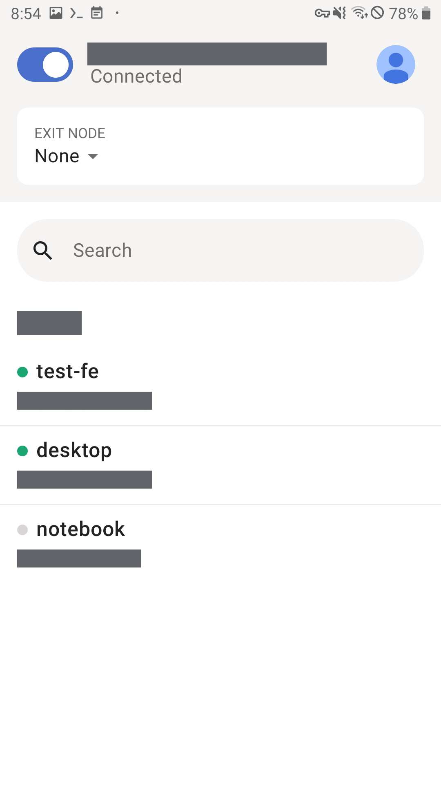
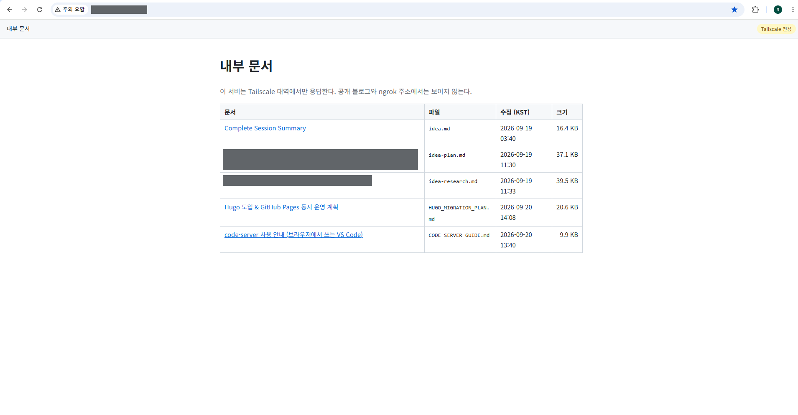

# 5. Private access — services only you can reach

<b>English</b> · [한국어](05-private-access.ko.md)

[← 4. Staying up](04-always-on.md) · Next: [6. Operations](06-operations.md)

---

The blog is meant to be public. Two other things on this phone are not: a viewer for
personal documents, and an editor with write access to everything. This page is how
they are kept private on a device with no firewall.


## 5.1 The threat model, written down first

| Who | What they can try |
|:---|:---|
| a stranger on the same Wi-Fi | scan the subnet, connect to any open port |
| a scanner on the internet | walk the ngrok domain for extra paths |
| someone who gets one URL | guess neighbouring paths, or read files outside the intended set |
| **a web page running in my own browser** | make requests to the private service using my own machine as the source |

The last row is the one that decides the design. Every network-level control passes for
a request that starts in my own browser, so it needs a separate answer (5.4).

## 5.2 Tailscale, and layer one: the bind address is the firewall

Install the **Tailscale app on Android**, not inside the container. The phone joins
your tailnet as a host, and anything listening on the phone's `100.x.y.z` address is
reachable from your other signed-in devices and from nowhere else.



On a normal server you would listen on `0.0.0.0` and let a firewall allow only the VPN
interface. That is not available here: `iptables` is not installed, and `proot`'s fake
root cannot insert kernel firewall rules anyway. So the socket is bound to the
Tailscale address itself, and the kernel refuses everything arriving on another
interface.

Finding that address is harder than it sounds. A minimal rootfs has no `ip` command,
`/proc/net/fib_trie` is permission-denied, and Android's VPN interface is `tun0` one
boot and `tun1` the next. Ask the kernel directly instead:

```python
TAILNET_V4 = ipaddress.ip_network("100.64.0.0/10")

def find_tailnet_ip():
    sock = socket.socket(socket.AF_INET, socket.SOCK_DGRAM)
    try:
        for _, name in socket.if_nameindex():
            try:
                packed = fcntl.ioctl(sock.fileno(), 0x8915,      # SIOCGIFADDR
                                     struct.pack("256s", name.encode()[:15]))
            except OSError:
                continue
            ip = socket.inet_ntoa(packed[20:24])
            if ipaddress.ip_address(ip) in TAILNET_V4:
                return ip
    finally:
        sock.close()
    return None
```

Make the bind address configurable and sooner or later somebody — including future you
— puts `0.0.0.0` in it. So an address outside the allowed ranges is a startup failure,
not a warning:

```
$ PRIVATE_DOCS_BIND=0.0.0.0 python3 private_docs_server.py
refusing to bind to 0.0.0.0: only tailnet (100.64.0.0/10) or loopback addresses are allowed
$ echo $?
2
```

**A VPN can be switched off.** Tailscale is an app; people turn it off, and it is not
up yet right after a reboot. The server writes one of three states to a file and never
improvises:

| State | Meaning | What the server does |
|:---|:---|:---|
| `waiting` | no tailnet address yet | retry every 5 s, open no socket at all |
| `listening <addr>:8081` | normal | re-check the address every 30 s |
| `offline <addr>:8081` | bound, then the VPN went down | keep waiting; back to `listening` if the same address returns |

If the address *changes*, the process exits with code 3. A bound socket cannot be moved
to a new address, so the supervisor restarts it onto the new one. There is no code path
anywhere that falls back to `0.0.0.0`: **it fails closed.**

## 5.3 Layers two and three: peer address, then `Host`

Binding looks sufficient. It is checked again per request anyway, because a
configuration mistake that widens the bind should still not widen access:

```python
def _peer_ok(self):
    peer = ipaddress.ip_address(self.client_address[0].split("%")[0])
    if peer.version == 6 and peer.ipv4_mapped:
        peer = peer.ipv4_mapped
    return any(peer in net for net in ALLOWED_NETS)   # 100.64.0.0/10, fd7a:115c:a1e0::/48
```

Now the interesting one. **DNS rebinding** defeats every check above:

1. An attacker owns `evil.example` and answers with their own IP, TTL a few seconds.
2. You open the page; its JavaScript loads.
3. The DNS answer changes to **your tailnet address**.
4. The page requests `http://evil.example:8081/raw/plan.md`. To the browser this is the
   *same origin*, so the script may read the response.
5. The request comes from your own laptop, so the peer check passes.

The one thing the attacker cannot forge is the `Host` header — browsers do not allow
it. So the server answers only when `Host` is a name or address inside your tailnet:

```python
def _host_ok(self):
    host = (self.headers.get("Host") or "").strip()
    # ... strip the port ...
    try:
        return any(ipaddress.ip_address(name) in net for net in ALLOWED_NETS)
    except ValueError:
        pass
    name = name.lower().rstrip(".")
    return bool(name) and (name.endswith(".ts.net")   # MagicDNS full name
                           or "." not in name)        # MagicDNS short name
```

A plausible-looking `localhost.evil.com` has a dot and does not end in `.ts.net`, so it
is refused. No CORS header is ever sent either: there is no legitimate reason for
another origin to read these responses.

Rejections are logged. **Successful reads are not** — the only thing that belongs in
this server's log is the unusual:

```
[DENY] Host header outside the tailnet peer=100.x.y.z host='evil.example.com' path='/'
```

## 5.4 Layer four: an allow-list, not a directory

Point a static file server at `/root` and one path-traversal bug leaks SSH keys. This
server does not expose a filesystem at all. Only documents named in a list exist:

```
# private_docs.list — a file not listed here cannot be opened, even with its URL
idea.md
idea-plan.md
HUGO_MIGRATION_PLAN.md
```



The filename in a request is used **as a key into that list**, never to build a path.
No amount of encoding trickery escapes a lookup table. There are also name rules (ends
in `.md`, no leading dot) and a 2 MB size cap. The list is re-read per request, so
adding a line takes effect without a restart.

## 5.5 Layer five: defence inside the browser

These documents contain text pasted from the web, which means they can contain HTML.
Markdown passes HTML through, so **my own document could run a script in my own
browser.**

- The server never parses markdown. It sends the source as `text/plain`; the browser
  renders it with [marked](https://github.com/markedjs/marked) and sanitises it with
  [DOMPurify](https://github.com/cure53/DOMPurify).
- Both libraries are **stored on the phone**, not loaded from a CDN, and were checked
  against the SRI hashes (sha512) the CDN publishes.
- Sanitisation strips `src` from remote images. Opening a document should not tell an
  outside server what you are reading, and when.
- Every response carries strict headers:

```
Content-Security-Policy: default-src 'none'; script-src 'self'; style-src 'self';
                         img-src 'self' data:; connect-src 'self'; base-uri 'none';
                         form-action 'none'; frame-ancestors 'none'
X-Content-Type-Options: nosniff
X-Frame-Options: DENY
Referrer-Policy: no-referrer
X-Robots-Tag: noindex, nofollow
Cache-Control: no-store
```

`script-src 'self'` blocks inline scripts and `eval`, so a sanitiser bypass still does
not execute. The cost is that the viewer's own code may not use inline scripts or
styles either — which is why the test suite has a case for "the viewer does not
violate its own CSP".

## 5.6 Keep it on its own supervisor

The docs viewer and code-server each have their own supervisor and their own job IDs
([`04-always-on.md`](04-always-on.md)). Merging them into the public supervisor would
mean a bad restart of the blog could take the private services with it, and a
`--kill-on-exit` cascade could take all three. They also start in different states: the
blog can start immediately, while the private services must wait for Tailscale.

## 5.7 code-server: VS Code, over HTTPS, inside the tailnet

Remote-SSH from a desktop VS Code does not work here, and the log says why:

```
error This machine does not meet Visual Studio Code Server's prerequisites, expected either...
  - find libstdc++.so or ldconfig for GNU environments
  - find /lib/ld-musl-aarch64.so.1, which is required ... in musl environments
```

SSH lands in **Termux**, which is bionic, not glibc or musl. The container one layer
in has glibc 2.43 — so run `code-server` in there and use a browser.

HTTPS is not optional even inside a VPN: without it the browser withholds the
clipboard, service workers and other features the editor needs. A self-signed
certificate you must click past every time is worse than useless, so the phone runs a
tiny CA and you trust that CA once per device.

The important part is **name constraints**. A root CA you trust can, by default, vouch
for any name on the internet. X.509 lets you cut that down to the names you care about,
and verifiers must honour it:

```bash
openssl req -x509 -new -newkey ec -pkeyopt ec_paramgen_curve:P-256 -nodes \
  -subj "/CN=phone-homeserver local CA" -days 3650 \
  -addext "basicConstraints=critical,CA:TRUE,pathlen:0" \
  -addext "nameConstraints=critical,permitted;IP:100.64.0.0/255.192.0.0,\
permitted;IP:fd7a:115c:a1e0::/ffff:ffff:ffff::,permitted;DNS:ts.net" \
  -keyout ca.key -out ca.crt
```

That CA can sign for tailnet addresses and `*.ts.net` names, and nothing else.
Certificates issued for a LAN IP or a public domain fail verification even though they
were signed by a CA your device trusts.

`code_server.sh` handles the rest: it finds the Tailscale address, issues a server
certificate with that address and your MagicDNS name in `subjectAltName`, renews it
before expiry, and starts the editor.

```bash
code-server --bind-addr "$ip:8443" --auth password \
            --cert "$SRV_CRT" --cert-key "$SRV_KEY" /root
```

Its health check verifies the certificate as well as the response, so a wrong or
expired certificate counts as a failure:

```bash
curl -s -o /dev/null -w '%{http_code}' --max-time 5 --cacert "$CA_CRT" "https://$1/healthz"
```

Two practical notes. Give it a **90-second grace period** after start — it is slow to
come up on a phone, and probing too early kills it in a loop. And expect **two
processes**: a wrapper and the Node process that actually listens, so a supervisor
pattern that matches only one of them will restart a service that is already running.

To trust the CA: copy `ca.crt` to each device and install it — on Android, Settings →
Security → Encryption & credentials → Install a certificate → CA certificate; on macOS,
Keychain Access; on Linux, `/usr/local/share/ca-certificates` plus `update-ca-certificates`.
Compare the SHA-256 fingerprint that `./code_server.sh status` prints before you do.

## 5.8 Verify

```bash
python3 tests/test_private_docs.py          # 47 black-box security tests
curl -s -o /dev/null -w '%{http_code}\n' http://<phone-lan-ip>:8081/    # expect 000
curl -s -o /dev/null -w '%{http_code}\n' -H 'Host: evil.example' http://100.x.y.z:8081/
./code_server.sh status
```

The suite covers path traversal, symlink escape, allow-list bypass, peer and `Host`
checks, the security headers, and the viewer's own CSP compliance. A useful extra
check: issue a certificate for a LAN IP from the local CA and confirm it **fails**
verification. That is the name constraint doing its job.

Next: keeping it healthy day to day → [6. Operations](06-operations.md)
