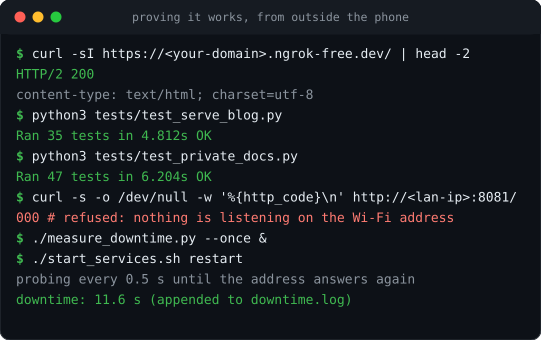
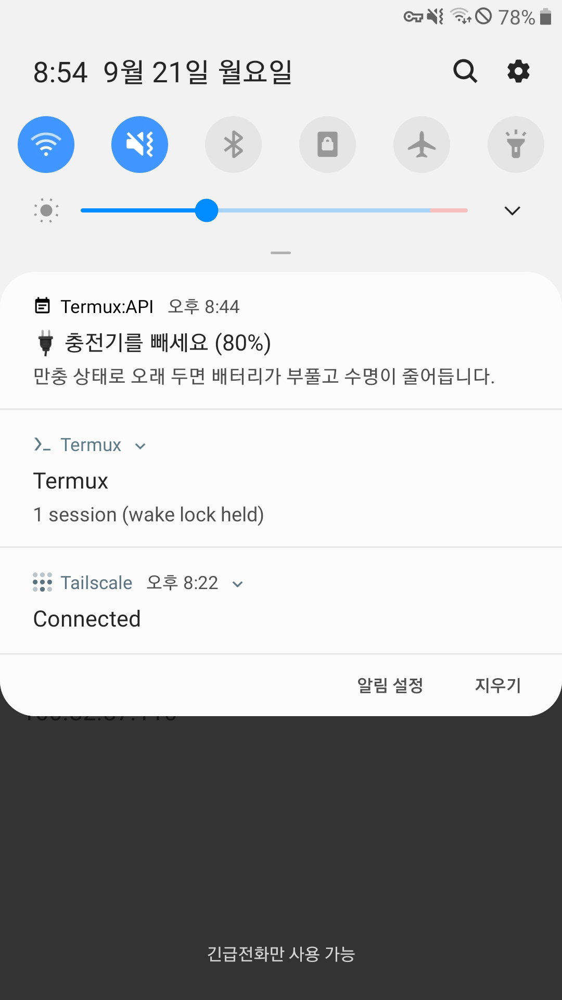
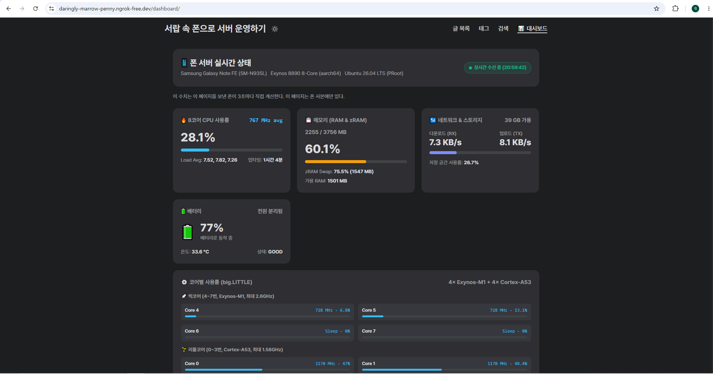

# 6. 운영 — 배터리, 열, 수치, 그리고 증거

[English](06-operations.md) · <b>한국어</b>

[← 5. 비공개 접근](05-private-access.ko.md) · 다음: [7. 문제 해결](07-troubleshooting.ko.md)

---

폰 서버에는 랙 서버에 없는 소모품이 둘 있다. 닳는 배터리와, 팬이 없는 케이스다. 이 문서의
모든 것은 그 둘이 실험을 끝내지 못하게 하려고, 그리고 인상 대신 수치를 남기려고 있다.



## 6.1 닳는 부품은 배터리다

안드로이드 9에는 충전 상한 설정이 없다. 꽂아 두면 하루 24시간을 100%에서 보낸다. 2017년
배터리에 이 말은 1~2년 안에 부푼다는 뜻이고, 사람이 없는 곳에 두는 기기의 부푼 배터리는
성능 이야기가 아니라 실제 위험이다.

루팅 없이 쓸 수 있는 유일한 수단은 알림이다. `termux/battery-watch.sh`는 Termux 쪽에서
15분마다 돈다(작업 4247번. 알림이 Termux:API를 지나기 때문이다). sysfs를 직접 읽는다.

```sh
SYS=/sys/class/power_supply/battery
HIGH=80      # 충전 중 이 값 이상이면 빼라고 알린다
LOW=30       # 방전 중 이 값 이하면 꽂으라고 알린다
```

찾는 데 시간이 든 구현 세부가 둘 있다.

- **SELinux 때문에 sysfs 디렉터리는 목록을 볼 수 없다.** 그러나 안의 개별 파일은 읽힌다.
  나열하려 하지 말고 `capacity`, `status`, `temp`, `current_now`, `voltage_now`를 이름으로
  읽는다.
- **히스테리시스를 넣는다.** 배터리가 정확히 80%에 머물면 15분마다 영원히 알림이 온다.
  임계값에서 5포인트 멀어져야 정상 상태로 돌아가게 했다.
- **낮은 쪽 알림은 진동도 울린다.** 안드로이드 알림 진동은 자다가 놓치기 쉽고 방해 금지
  모드가 아예 꺼 버린다. 그래서 LOW 분기에서 `termux-vibrate -d 600 -f`를 세 번 부른다.
  `-f`는 무음 모드에서도 울리게 하는 옵션이다. 배터리가 다 닳으면 서버가 같이 멈추지만
  가득 찬 배터리는 수명이 줄 뿐이라, 깨어날 만한 쪽은 아래쪽 하나다.

실행마다 한 줄이 쌓이고, 로그는 512KB에서 직접 회전시킨다.

```
2026-09-20 21:15:02 KST pct=80 status=Charging temp=31.5 mA=-412 mV=4301
```

알림이 도착한 모습이다. Termux의 웨이크 락, Tailscale의 연결 상태와 나란히 떠 있다. 이 세
알림이 함께 보이면 서버가 정상이라는 뜻이다.



이 로그가 전력에 관한 질문에 답할 수 있게 해 준다. 실제 부하에서의 충전·방전 속도와, 그때
폰이 얼마나 뜨거운지다.

## 6.2 열

팬이 없고, 케이스를 씌웠고, 충전 중이고, 부하가 걸렸다면 폰은 스로틀링한다. 똑똑한 방법보다
이 셋이 더 낫다.

- **케이스를 벗긴다.** 뒷판이 방열판이다.
- **화면은 꺼 두고 밝기는 낮춘다.** 디스플레이가 가장 큰 단일 전력 소모원이고 상당한
  발열원이다.
- **100% 충전 상태에서 무거운 작업을 돌리지 않는다.** 충전 자체가 발열이다. 고속 충전 중에
  사이트를 빌드하는 것이 최악의 조합이다.

CPU 센서보다 배터리 로그의 `temp`를 본다. `proot` 안에서는 thermal zone을 안정적으로 읽을
수 없고, 배터리의 서미스터는 내가 내려야 할 판단 — "이대로 계속하기에 너무 뜨거운가" —
에는 충분히 가깝다.

## 6.3 메트릭 엔드포인트

`serve_blog.py`는 `/api/metrics`를 제공한다. 대시보드의 유일한 데이터 출처다.

```bash
curl -s http://127.0.0.1:8080/api/metrics | python3 -m json.tool | head -30
```

CPU 사용률, 메모리와 스왑, 배터리 잔량과 상태, 온도, 가동 시간, 로드 애버리지를 돌려준다.
수집 방식을 결정한 제약이 둘이다.

- **`proot` 안의 `/proc`은 거짓을 말한다.** `/proc/stat`, `/proc/uptime`,
  `/proc/loadavg`는 정적이거나 조작된 값을 돌려준다. 가동 시간과 로드는 `ctypes`로
  `sysinfo(2)` 시스템 콜을 불러 얻고, CPU 사용률은 Termux 쪽에서 구한다.
- **배터리 값은 Termux:API에서 온다.** 즉 이 호출은 안드로이드 앱이 살아 있는지에 의존한다.
  배터리 필드가 없으면 0이 아니라 "알 수 없음"으로 취급한다.



이 값을 쓰는 대시보드는 폰 사본에만 빌드된다. 공개 방문자의 브라우저가 내 폰을 찌르게 두면
안 된다([`02-web-server.ko.md`](02-web-server.ko.md)).

## 6.4 다운타임은 추측하지 않고 잰다

서로 다른 두 숫자를, 서로 다른 방법으로 잰다.

**계획된 재시작** — 프로브를 띄운 뒤 재시작하고 간격을 읽는다.

```bash
./measure_downtime.py --once &        # 기본 0.5초 간격
./start_services.sh restart
# downtime: 11.6 s   → downtime.log에 기록된다
```

쓸모 있는 옵션: `--local`은 공개 주소 대신 `127.0.0.1:8080`을 찌른다. `--interval`은
해상도와 요청 수를 맞바꾼다(ngrok 무료 플랜은 요청 수를 센다). `--once`는 한 번의
중단·복구 주기 뒤 끝난다.

**예기치 않은 중단** — 감독자마다 하트비트 파일을 유지하고 시작할 때 비교하므로, 아무도
보고 있지 않아도 간격이 원인과 함께 남는다.

```
Last Downtime: 168s (unexpected_shutdown_or_reboot, 2026-09-19 17:27:59 ~ 17:30:47 UTC)
```

"사이트가 떠 있었는가"를 묻는다면 로컬 포트가 아니라 공개 주소를 재야 한다. 빌드 교체를
0.3초에 끝낸 재시작도 터널에서는 12초를 쓸 수 있고, 그것은 밖에서 재야만 보인다.

## 6.5 폰을 익히지 않고 부하 시험하기

단계별 부하, 쿨다운, 클라이언트 스크립트가 담긴 전체 규격은
[`reference/STRESS_TEST_SPEC.md`](reference/STRESS_TEST_SPEC.md)에 있다. 숫자보다 구조가
중요하다.

- **부하는 PC에서 만든다.** 시험 대상 기기에서 돌리는 부하 생성기는 부하 생성기를 잰다.
- **Tailscale로 `100.x.y.z:8080`을 직접 때린다.** 그래야 ngrok 엣지와 내 업링크가 아니라
  폰을 재는 것이 된다.
- **단계마다 쿨다운을 넣어 올린다.** 그리고 단계마다 `/api/metrics`를 읽는다. 팬 없는
  기기에서 흥미로운 실패는 열이고, 열은 부하가 몇 분 지속된 뒤에야 나타난다.
- **오류가 아니라 온도로 중단한다.** 상한은 시작 전에 정한다.

## 6.6 테스트 돌리기

```bash
python3 tests/test_serve_blog.py      # 35개
python3 tests/test_private_docs.py    # 47개
```

둘 다 블랙박스다. 임시 디렉터리와 자체 포트에 자기 서버를 띄우므로, 운영 중인 폰에서 언제
돌려도 안전하다. 서버 파일을 고친 뒤에, 그리고 `publish` 전에 돌린다.

테스트가 실제로 무언가를 확인하는지 보려면 사본을 일부러 망가뜨린다.

```bash
cp serve_blog.py /tmp/x.py     # 사본에서 경로 검사를 지운다
# 6개가 실패해야 한다. 전부 통과하면 그 테스트는 장식이다.
```

## 6.7 일상 점검

**서비스를 제대로 멈춘다.** 비활성 플래그를 만들지 않으면 런처와 15분 작업이 방금 멈춘
것을 다시 띄운다.

```bash
touch /root/.services_disabled        # 블로그 + ngrok
touch /root/.private_docs_disabled    # 문서 뷰어
touch /root/.code_server_disabled     # code-server
./start_services.sh stop
# ... 점검 ...
rm /root/.services_disabled && ./start_services.sh start
```

**로그.** 로그는 모두 `/root/logs/`에 쌓인다. 폴더가 없으면 감독자가 만든다. 감독자는
각자 로그를 회전시킨다(블로그 10MB, 비공개 서비스 2MB, 배터리 감시 512KB). 방치해서 자라는 것은 없지만, `/root/blog_builds/`는 배포마다 디렉터리가 하나씩
쌓이므로 가끔 정리한다.

```bash
ls -1dt /root/blog_builds/* | tail -n +6 | xargs rm -rf
```

**이 넷은 백업한다.** 나머지는 이 저장소에서 다시 만들 수 있다.

| 무엇 | 이유 |
|:---|:---|
| 블로그 원본 저장소 | 내가 쓴 글이다. git에 있으니 push한다 |
| `~/.config/ngrok/ngrok.yml` | 토큰, 곧 내 고정 주소 |
| `/root/.config/code-server/tls/ca.key`와 `ca.crt` | CA를 잃으면 모든 기기에서 다시 신뢰시켜야 한다 |
| `/root/private_docs.list` | 내 허용 목록. 저장소에는 없다 |

**주 1회, 1분.** status 명령 셋, 배터리 로그 한 번, 배포 상태 확인이다.

```bash
./start_services.sh status && ./private_docs.sh status && ./code_server.sh status
tail -3 /root/logs/battery_watch.log
./publish_blog.sh status
```

다음: 무언가 고장났을 때 → [7. 문제 해결](07-troubleshooting.ko.md)
